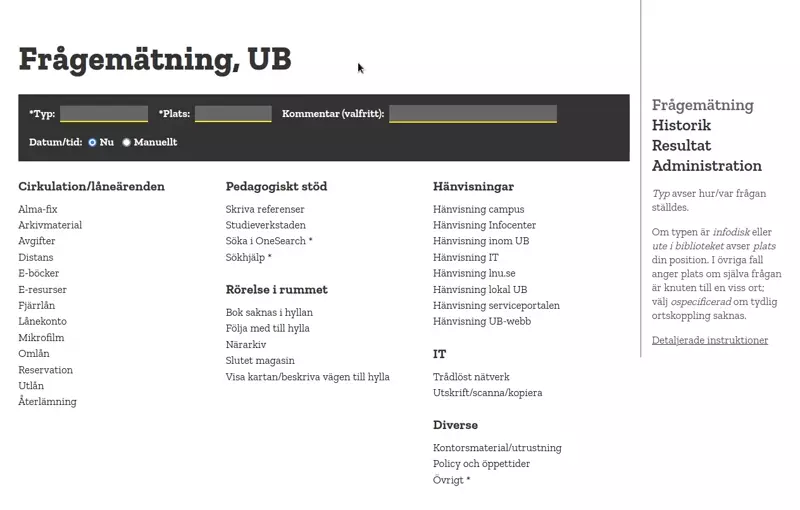

# Frågemätning

Detta är ett enkelt verktyg för att snabbt registrera och
statistikföra frågor som inkommer till receptioner eller via andra
kanaler. Det utvecklades ursprungligen för användning i UX-arbetet på
Linnéuniversitetets bibliotek. Då andra visat intresse för verktyget
har det publicerats här som öppen källkod under *GNU General Public
License v. 3* (se mer nedan).

## Användning

Fördefinierade frågor presenteras uppdelade i kategorier. När en fråga
inkommer klickar man på den. I normalfallet registreras en fråga så,
med ett enda klick. Inledningsvis behöver man dock ange a) typen av
medium/kanal, b) plats. Det är också möjligt, men alltså inte
obligatoriskt, att skriva en kommentar samt att manuellt ange tiden
för frågan (innan man klickar på den).

Vid registrering visas en bekräftelse, som också erbjuder möjligheten
att ångra inmatningen. Efterhandsjusteringar kan också göras under
menyvalet *Historik*, där alla registrerade frågor listas per session.

Under menyvalet *Resultat* återfinns en uppsättning diagram och
tabeller som presenterar registrerade frågor fördelade på tid, typ,
plats, kategori m.m. Resultatet kan även avgränsas på datum m.m. med
hjälp av en uppsättning filterinställningar överst på sidan. Om man
t.ex. väljer `Veckodag: Måndag` beräknas resultatet enbart på frågor
registrerade på måndagar. All inmatad data (eller data för aktuellt
urval), inklusive ev. kommentarer, kan exporteras till CSV för vidare
behandling i exv. ett kalkylprogram.

## Uppsättning och konfiguration

Appen kräver (en någorlunda ny version av) Node.js samt en
databasserver av typen MariaDB/MySQL.

Databaskoppling m.m. konfigureras i `/backend/config.json`. Val för
typ och plats m.m. konfigureras i `/frontend/src/config.json`. Möjliga
inställningar framgår av `config.example.json` i respektive katalog.

Parametern *users* i `/frontend/src/config.json` definierar
användarkategorier. Med detta avses de som använder verktyget (inte de
som ställer frågorna). Resultatet kan avgränsas till sådan
användarkategori, och olika frågor kan visas för olika kategorier. Det
går bra att ange bara en användarkategori här.

För enkel installation:

1. Klona denna repo: `git clone https://gitlab.com/lnu-ub/fragematning.git`
2. Kör `npm install` i såväl `/backend` som `/frontend`
3. Kopiera `config.example.json` till `config.json` i såväl `/backend`
   som `/frontend/src`. Justera därpå innehållet (se ovan om
   konfiguration).
4. Kör `npm run prod` i `/frontend`

Appen behöver sedan startas från `/backend` med `node index.js`. Den
lyssnar på den port som konfigurerats i `/backend/config.json`. (Det
rekommenderas att appen sedan servas genom en riktig webbserver såsom
Apache eller Nginx med s.k. "reverse proxy".)

När appen är igång kan frågor och kategorier definieras under
*Administration* i menyn. Till varje fråga kan även fogas en
förklarande text. För administrationsdelen finns en rudimentär
inloggning. Användare/lösenord anges i `/backend/config.json`. (För
övriga delar av gränssnittet får man begränsa åtkomsten på annat vis,
t.ex. baserat på IP.)

Verktygets utseende anpassas lämpligen med `/frontend/src/custom.css`.

En notering om kodens övriga beroenden: backend-delen är byggd på
Express. Frontend-delen använder inget särskilt ramverk, men Webpack
har använts för att transformera och packa koden. Diagrammen ritas med
hjälp av Chart.js.

## Docker

Vill man köra applikationen med hjälp av docker kan man bygga en image
med hjälp av `docker-compose`. Man behöver skapa en fil `.env` med parametrar
för docker (se `.env.sample`). Följ också anvisningarna för konfiguration
av applikationen ovan, då konfigurationerna i `backend/config.json` och
`frontend/config.json` kommer kopieras in i den docker-image som byggs.

För att bygga image kör man sedan `docker-compose build` som då bygger image
med konfigurationen i sig.

När image är byggd kan man starta paketet med `docker-compose up` (eller om
man vill starta det i bakgrunden `docker-compose up -d`). Därefter kan man gå
till den port man specificerat i sin `.env`-fil för att komma åt systemet.

Observera att docker-lösningen inte hanterar lösenordsskydd av applikationen
som sådan. Den hanterar inte heller certifikat för kryptering. Detta löses 
lämpligen med reverse-proxy via Nginx eller Apache. Lösenordet för åtkomst
till de administrativa delarna av applikationen ligger inbakat i den image
man byggt så den följer med i docker-lösningen.

## Brister

Det är fråga om en till utförandet mycket enkel applikation. Den
saknar flerspråksstöd, inbyggt stöd för inloggning m.m.

Det går hjälpligt bra att registrera frågor på en mobil, men övriga
vyer fungerar inget vidare på smala skärmar.

## Licens / License

Copyright (C) 2022 Jonas Enberg

This program is free software: you can redistribute it and/or modify
it under the terms of the GNU General Public License as published by
the Free Software Foundation, either version 3 of the License, or (at
your option) any later version.

This program is distributed in the hope that it will be useful, but
WITHOUT ANY WARRANTY; without even the implied warranty of
MERCHANTABILITY or FITNESS FOR A PARTICULAR PURPOSE. See the GNU
General Public License for more details.

You should have received a copy of the GNU General Public License
along with this program. If not, see <https://www.gnu.org/licenses/>.

## Kontakt och upphov

Skicka gärna frågor till Jonas Enberg (<jonas.enberg@lnu.se>), som
utvecklat verktyget.
